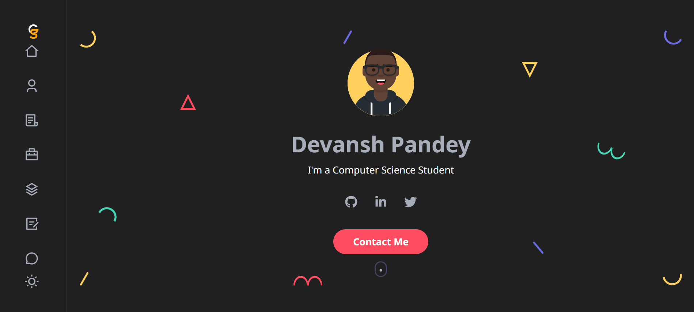

<h1 align="center">
  <br>
  
  <br>
  Devansh Pandey's Personal Website
  <br>
</h1>

<h4 align="center">A personal portfolio website built with React.js showcasing my skills, projects, and experience.</h4>

<br>



## 🚀 Features

- Showcases projects, skills, and experience
- Clean, responsive UI built with React
- Contact form integrated with EmailJS
- Fully customizable and open-source

## 🛠️ Tech Stack

- React.js
- HTML & CSS
- EmailJS (for contact form)
- React Toastify

## 📦 Getting Started

To clone and run this application locally, you'll need [Git](https://git-scm.com) and [Node.js](https://nodejs.org/en/download/). Then run:

```bash
# Clone this repository
$ git clone https://github.com/devanshpandey2003/devansh-portfolio

# Go into the repository
$ cd devansh-portfolio

# Install dependencies
$ npm install

# Run the app
$ npm start
